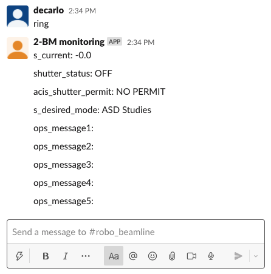
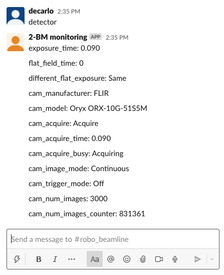
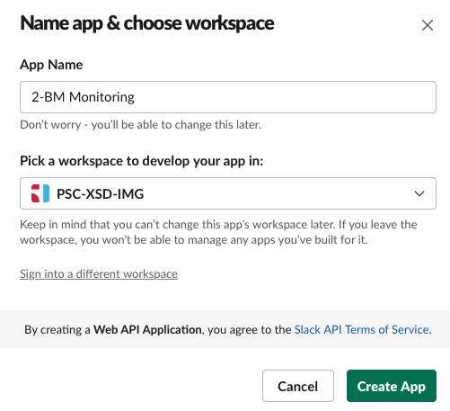
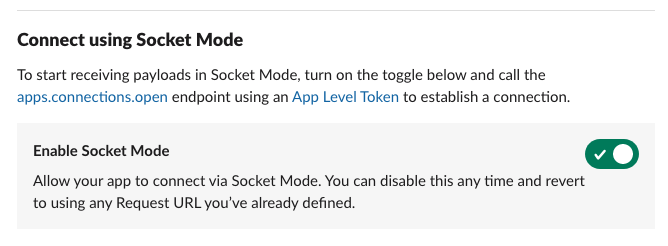
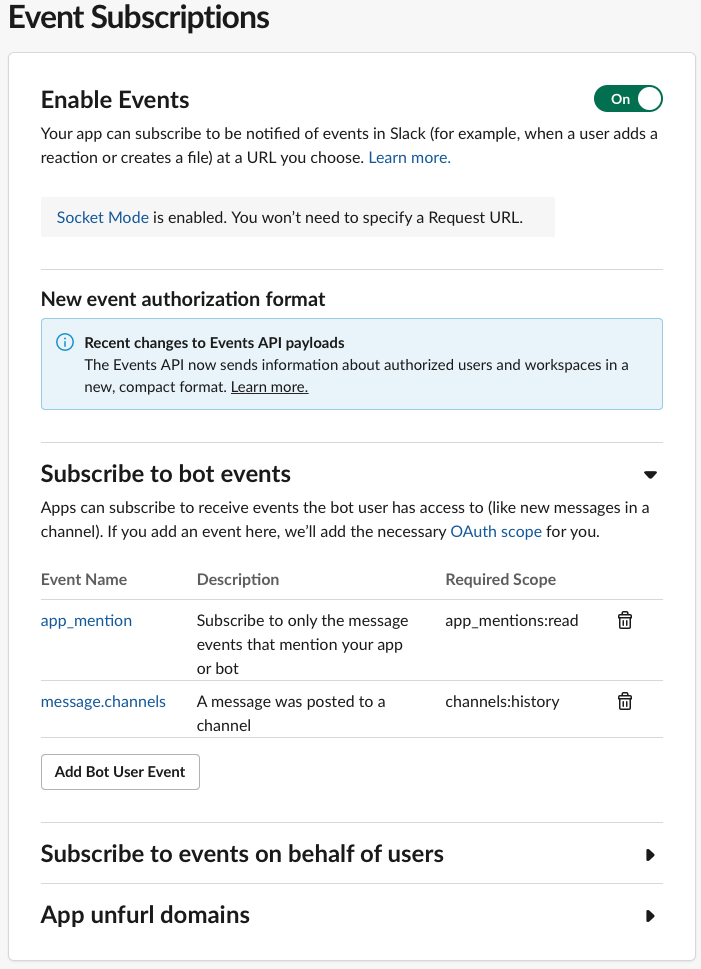
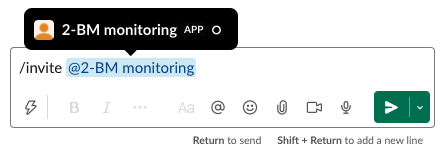

=============
APS Slack bot
=============

Usage
=====

::

    $ slackaps
      Bolt app is running!

then go to the autorized slack channel and type::

	help

.. image:: docs/source/img/help.png
    :width: 50%
    :align: center

and select any of the available options:

If an EPICS PV is not available slack with reply with::

	PV 2bmb:TomoScan:RotationStart" is not connected

also the slackaps console logger will report the same:

.. image:: docs/source/img/logs.png
    :width: 50%
    :align: center

Installation
============

Pre-requisites
--------------

Read the `Getting started with Bolt for Python <https://slack.dev/bolt-python/tutorial/getting-started>`_  guide and `create a Slack app <https://api.slack.com/apps/new>`_ 

Select **From scratch** and follow the on-screen instructions.

Mode
----

Select **Socket Mode** 

.. image:: docs/source/img/socket_mode_01.png
    :width: 50%
    :align: center

- Enable Socket Mode 
- Choose Token Name (e.g. MyToken)  
- Click “Generate” 

.. warning:: It is important to treat the **OAuth Token** as a password and never include it in your code. One option is to set it as and environment variable. To do this, copy token xapp-1- in a file in your user home directory e.g.::

    ~/.slackenv

as APP_TOKEN=xapp-1-........

Features and functionalities
----------------------------

Add features and functionalities (enable all those that are green)

.. image:: docs/source/img/features_functionalities.png
    :width: 50%
    :align: center

- Incoming webhooks (this allows your bot to post messages and files in the chat; note that the green check mark on the screen shot above does not appear right away, but at some point later in the process)

- Event subscription; Subscribe to bot events with “Add Bot User Event”:

Scopes
------

Once the Slack app is created you need to set the Slack app capabilities and permissions. These are called `scopes <https://api.slack.com/scopes>`_ and can be set accessing the Bot Token Scopes under the  **OAuth&Permissions** tab at:

.. image:: docs/source/img/features.png
    :width: 50%
    :align: center

and selecting the following:

.. image:: docs/source/img/scopes.png
    :width: 50%
    :align: center

Once this is done, select the **Install to Workspace** to obtain the **Bot User OAuth Token** and copy it in::

    ~/.slackenv

as BOT_TOKEN=xoxb-........

Finally you need invite the Slack app to a specific slack channel:

Installing from source
======================

In a prepared virtualenv or as root for system-wide installation clone the 
`slackaps <https://github.com/xray-imaging/2bm-slack.git>`_ from `GitHub <https://github.com>`_ repository

::

    $ git clone https://github.com/xray-imaging/2bm-slack.git slackaps

To install slackaps, run::

    $ cd slackaps
    $ python setup.py install

.. warning:: Make sure your python installation is in a location set by #!/usr/bin/env python, if not please edit the first line of the bin/dmagic file to match yours.

Dependencies
============

Install the following package::

    $ pip install python-dotenv
    $ pip install slack-bolt
    $ pip install pyepics
